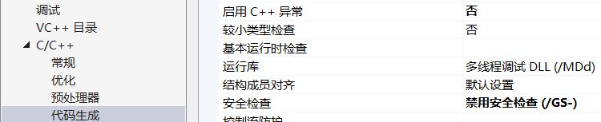

# **缓冲区溢出**

## 实验目的

- 了解缓冲区溢出的基本知识、一种情况以及危害
- 学会查看、阅读理解visual studio的反汇编窗口、内存器窗口、寄存器窗口的变化

## 实验相关知识

1. 缓冲区溢出的基本概念
    - 向缓冲区内填充数据时超过了缓冲区本身的容量，数据使用到了被分配内存空间之外的内存空间，覆盖了其他内存空间的数据
2. 反汇编常用指令解释
    - call：调用函数，一般函数的参数放在寄存器中
    - push：把一个操作数压入堆栈中，这个操作会使得esp被减4（字节），esp通常是指向栈顶的，这里顶部是地址小的区域，那么，压入堆栈的数据越多，esp也就越来越小
    - pop：与push相反，esp每次加4（字节），一个数据出栈。pop的参数一般是一个寄存器，栈顶的数据被弹出到这个寄存器中
3. 相关寄存器知识
    - 寄存器可分为两类：通用寄存器和专用寄存器。
    - 通用寄存器保存用于一般操作（如将两数相加或引用数组中的元素）的数据。
        - 32位寄存器EAX, EBX, ECX, EDX, EBP, ESP, EDI, ESI
        - EAX, EBX, ECX, EDX都可以作为32位寄存器、16位寄存器或者8位寄存器使用。
        - ESP寄存器指针始终指向栈顶
        - EBP寄存器指针指向栈底，可以通过栈底地址和偏移相加减来获取变量地址
        - EIP寄存器指针存储下一条指令的地址，
4. argc：整数，用来统计运行程序时送给main函数的命令行参数的个数  
argv：argv[0]代表文件名，argv[1]代表程序内使用的参数，可在调试里面自行设定

## 实验过程

1. 实验准备
    - 实验代码

        
    - 实验准备  
    打开project的属性
        - 将C/C++代码—代码生成属性的"启用异常检查"、"较小类型检测"设置为"否"，"安全检查"设置为"禁用安全检查(GS)"
            
        - 将C/C++代码—所有选项属性中的"SDL检查"设置为"否"
            
        - 打开调式——窗口里的"寄存器"、"内存"，点击"本地windows调试器"，右键转到反汇编(这里断点从sub(argv[1])开始)
            
            
            
        - 原因；  
        ①防止由于缓冲区溢出报错无法观察实验过程  
        ②寄存器、内存的变化用于更好的理解溢出的过程、状况和原因

2. 运行过程
    - 将字符串x设置为999999999999999999999
        
    - 打开寄存器、内存窗口，转到反汇编，开始调试
    - 可以观察到，当调用函数以后，会开辟新的栈空间先存放参数和eip，将main函数的ebp压栈，mov ebp, esp将当前函数的esp赋给ebp，得到当前函数的栈底地址。
        
    - 要留出局部变量的空间，于是sub esp,4ch
    - 接下来就是一系列指令的执行，在过程中，我们并没有看到任何关于溢出的报错，直到函数运行结束，所有栈内元素出栈
    - 我们可以看到ebp出栈后，ebp的地址变为了39393939，说明sub函数的栈帧被破坏
        
        